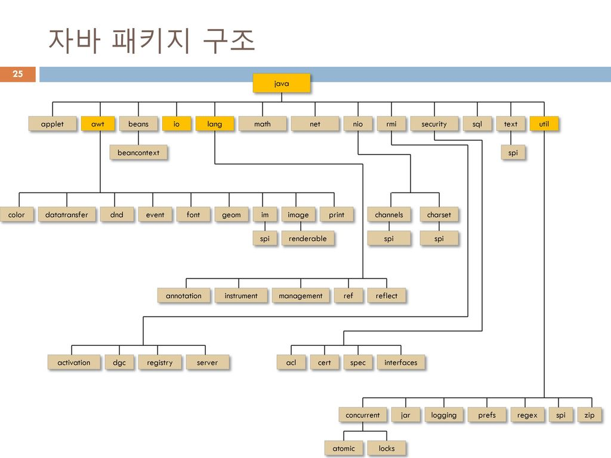

1. 패키지 package  
	폴더 / 디렉토리 : 서로 관련있는 클래스나 컴파일된 클래스 파일들을 한 곳에 묶어 놓은 것  
	JDK는 개발자에게 많은 클래스 파일들을 패키지 형태로 제공한다  
	rt.jar 압축파일로 제공되며, 내부는 폴더 구조로 정리되어 있는 것을 볼 수 있다.  
	
	1) 클래스명
		- 클래스를 지칭할 때 패키지명을 포함하는 경로명을 사용한다.  
		- 패키지와 패키지사이는 점 연산자를 사용.  
 	2) 패키지 필요성  

	3) 패키지 사용  
		- 기본적으로 클래스 사용시, 패키지명을 포함한 전체 경로명을 기술해야함.  
		```java
		java.util.Scanner sc = new java.util.Scanner(System.in);
		```
	4) import문
		- import 패키지..클래스명;
		```java
		import java.util.Scanner;
		Scanner sc = new Scanner(System.in);
		```
		- 한 패키지 안에 있는 여러 클래스를 사용하고 싶은 경우  
		```java
		import java.util.*; // util패키지에 있는 모든 클래스 임포트
		```  
	5) package 만들기  
		폴더 만들고 java파일 상단에 package 패키지명; 기술  

2. API Application Programming Interface  
	자바에서 제공하는 기본 패키지를 Java API라고 한다.
	
	
	1) API 문서  
		- Java SE : https://docs.oracle.com/en/java/javase/11/docs/api/  
		- Java EE (웹) : https://javaee.github.io/javaee-spec/javadocs/  
	2) API  
		- java.awt 		: GUI  
		- java.beans		: == 컴포넌트 클래스  
		- java.io			: Input/Output(I/O), 입출력관련. File  
		- java.lang		: 기본 패키지 *  
		- java.math		: 기본 연산이외에 더 다양한 연산이 필요할 때 사용하는 패키지  
		- java.net		: 네트워크 관련  
		- java.nio		: new I/O  
		- java.security		: 보안 관련  
		- java.sql		: 데이터베이스 (*)  
		- java.text		: 글자 관련(폰트 색깔)  
		- java.util		: 배열 대신 사용할 것. 날짜, 벡터, 해시맵, 데이터 저장 등  
		- javax.~ : 서포트하는 패키지  
		* 그외  
			- 구글 API  
			- 네이버 API : https://deveploers.naver.com/main/  
			- 카카오 API : https://deveploers.kakao.com/  
			- 공공데이터 포털 : https://www.data.go.kr/  

3. java.lang
	기본패키지. import 필요 없음
	1) Object 클래스 : 최상위 클래스
		* == 연산자 : 기본형이면 값 비교, 참조형은 주소 비교  
		  boolean equals(Object obj) : 기본적으로 주소비교. 사용사에 의해 오버라이딩해서 사용 가능  
		  ex) String 클래스의 equals()  
	2) String 클래스 : 문자열 클래스  
		스트링 리터널은 자바 컴파일러에 의해 모두 String 객체로 처리  
		1. 생성자  
		```java
		String()  
		String(String original) // 문자열 넣으면서 객체 생성  
		String(char[] value) // char 배열의 문자들을 String 객체로 생성  
		String(StringBuffer buffer) // 스트링버퍼 문자열을 String 객체로 생성  
		```
		2. string리터럴과 new String()  
		```java
		String str = "hello"; //리터럴 방식  
		String str = new String(); //객체 생성 방식  
		```
		3. 스트링은 수정 불가능  
		4. 주요메서드  

	
