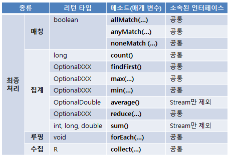

1. 스트림
	- 자바8부터 추가된 컬렉션의 저장요소를 하나씩 참조해서 람다식으로 처리할 수 있도록 해주는 '반복자'이다.
	
	1) 반복자 스트림
		자바7 이전까지는 Iterator 반복자 사용하여 컬렉션 요소를 순차 처리함.
		이제는 Stream 이용도 가능
	2) 스트림의 특징
		- Steam은 Iterator와 비슷한 역할을 하는 반복자  
		- 둘의 차이점 : 람다식으로 요소처리코드를 제공, 내부 반복자를 사용하므로 병렬처리가 쉬움, 중간처리와 최총처리 작업을 수행.  
		
		* 외부반복자(external iterator)란?  
			개발자가 코드로 직접 컬렉션의 요소를 반복해서 가져오는 코드 패턴을 말함.  
			반면에 내부반복자(internal iterator)는 컬렉션 내부에서 요소들을 반복시키고, 개발자는 요소당 처리해야 할 코드만 제공하는 코드 패턴을 말함.  
			

		- 스트림은 중간처리와 최종처리를 할 수 있다.  
		  중간처리에서는 매핑,필터링, 정렬을 수행하고 최종처리에선 반복, 카운팅, 평균, 총합 등 집계처리를 수행한다.
		 			

2. 스트림의 종류  
	java.util.stream패키지에 Stream API들이 들어있다.  
	
	BaseStream  
		- Stream  
		- DoubleStream  
		- IntStream  
		- LongStream  
		  
		
	1) 컬렉션으로부터 스트림 얻기  
		컬렉션변수.stream();  
	2) 배열로부터 스트림 얻기  
		Arrays.stream(배열);  
	3) 숫자 범위로부터 스트림 얻기  
		IntStream.range(int start, int endExclusive);  
		IntStream.rangeClosed(int start, int endInclusive);  
	파일, 디렉토리는 pass  
3. 스트림 파이프라인  
	다량의 데이터를 가공해서 축소하는 것을 일반적으로 리덕션이라한다.  
	데이터의 합계, 평균값, 카운팅, 최대값, 최소값 등을 대표적인 리덕션의 결과물이라 한다.  
	컬렉션 요소를 리덕션의 결과물로 바로 집계할 수 없을 경우, 필터링, 매핑, 정렬, 그룹핑등 중간 처리가 필요하다.  
	
	중간처리와 최종처리를 파이프라인으로 해결한다.  
  	파이프라인은 여러 개의 스트림이 연결되어 있는 구조를 말한다.  
	- **[ 메서드 사용 구조 ]**
		  
	- **[ 중간처리 메서드 ]**  
		  
	- **[ 최종처리 메서드 ]**
		  
